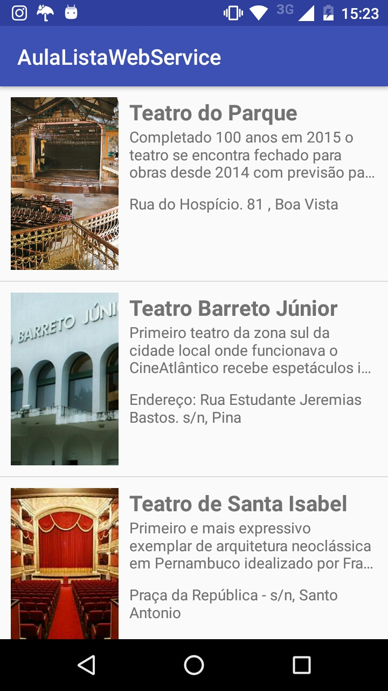

Listando dados de um WebService local
==============
Exemplo de código listando dados de um [Stub WebService] e adiciando a um list view customizado.

 

### Rodando a aplicação:
1. Baixar o [Stub WebService] e rodar localmente;
2. Rodando no simulador: Utilizar o IP `127.0.0.1` na String `BASE_URL`;
3. Rodando no dispositivo: Conectar o aparelho na mesma rede wifi que o servidor está rodando e utilizar o IP da rede wifi na String `BASE_URL`;

### Bibliotecas utilizadas:
1. [Picasso] 
2. [Retrofit]

   [Picasso]: <http://square.github.io/picasso/>
   [Retrofit]: <http://square.github.io/retrofit/>
   [Stub WebService]: <https://github.com/wesleygalindo/android-classes/tree/master/ServidorAulaAndroid>

